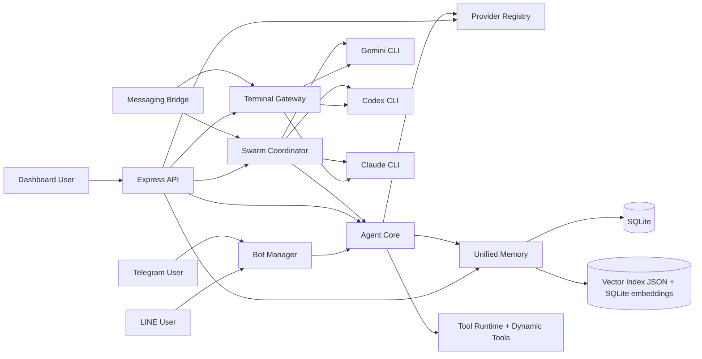

# PersonalAIBotV2 - Project System Handbook (Canonical)

Last verified from code: **March 12, 2026** (Asia/Bangkok)  
Workspace root: `C:\Users\MSI\PersonalAIBotV2`

This document is the single source of truth for understanding the system without re-reading the full codebase each time.
If older docs conflict with this file, use this file first, then verify the specific module in code.

---

## 1. Purpose and Scope

This handbook is for:

- new developers joining the project
- future teams during handover
- new chat sessions with AI assistants that need fast project context
- operations/debugging without re-discovering architecture each time

It covers:

- system architecture
- startup and runtime flow
- module responsibilities
- API and Socket surfaces
- memory/provider/swarm behavior
- security model
- runbook and troubleshooting

---

## 2. What This Project Is

`PersonalAIBotV2` is a unified AI bot platform that combines:

- multi-channel messaging bots (LINE + Telegram)
- web dashboard + terminal gateway
- multi-provider LLM routing
- hybrid memory (working + recall + archival vector memory)
- Jarvis-led multi-agent swarm orchestration
- optional automation/plugin controls

Main runtime is in `server/` and `dashboard/`.

---

## 3. Fast Start (Operator View)

### 3.1 One-click start (Windows)

Use:

```bat
start.bat
```

Modes:

- default: compact mode (`STARTUP_COMPACT=1`, cleaner logs)
- verbose: `start.bat --verbose`

`start.bat` does this:

1. checks if port `3000` is already in use and exits cleanly if occupied
2. checks/install dependencies for `server` and `dashboard`
3. builds dashboard
4. starts server on port `3000`

### 3.2 Core URLs

- App: `http://localhost:3000`
- Webhook root: `http://localhost:3000/webhook`
- Health: `http://localhost:3000/health`
- Metrics: `http://localhost:3000/metrics`
- OpenAPI UI: `http://localhost:3000/api-docs`

---

## 4. High-Level Topology



Operational core agents/topology are declared in:

- `server/src/system/agentTopology.ts`
- `server/src/api/systemRouter.ts`

Runtime introspection endpoints:

- `GET /api/system/agents`
- `GET /api/system/plugins`
- `GET /api/system/topology`

---

## 5. Repository Map

### 5.1 Root directories

- `.agent/skills/unified_bot_v2` - architecture notes used in recent development cycles
- `server/` - backend runtime (API, bots, memory, swarm, terminal, providers)
- `dashboard/` - React dashboard
- `fb-extension/` - browser extension assets/source
- `data/` - runtime data (DB, uploads, indexes)
- `docs/` - project docs (many are phase-based; this handbook is canonical)

### 5.2 Backend core folders (`server/src`)

- `api/` - Express routes and HTTP surface assembly
- `bot_agents/` - agent core, tools, registries, bot manager
- `memory/` - unified memory, vector store, embeddings
- `swarm/` - planner, coordinator, queue, specialists
- `terminal/` - command routing, PTY/session gateway, boss bridge
- `providers/` - provider registry/factory/health/key management
- `database/` - SQLite initialization and data access helpers
- `evolution/`, `scheduler/` - idle loop, reflection/healing, subconscious jobs
- `system/` - topology/plugin metadata and runtime snapshots

### 5.3 Dashboard core folders (`dashboard/src`)

- `pages/` - major UI modules (`MultiAgent`, `JarvisTerminal`, `Settings`, etc.)
- `services/api.ts` - authenticated API client
- `hooks/useSocket.ts` - shared Socket.IO client
- `components/` - UI building blocks (includes terminal component usage)

---

## 6. Backend Startup Sequence

Main entry file: `server/src/index.ts`

Startup order:

1. validate env and print config report (`validateAndReport`)
2. create Express + HTTP + Socket.IO
3. install middleware (CORS, headers, metrics, logging, JSON/raw-body handling, sanitization, timeout, rate limits)
4. initialize DB and tables (`initDb`, bot tables, usage, goals, queue table)
5. initialize unified memory
6. initialize provider registry/factory and provider health checker
7. mount socket token endpoint (`/api/auth/socket-token`)
8. register HTTP surface (`registerHttpSurface`)
9. attach socket auth and socket handlers
10. setup terminal gateway
11. start bot manager and swarm coordinator
12. wire terminal `@agent` handler and swarm socket events
13. start idle/subconscious background loops
14. start HTTP listen on configured port

Graceful shutdown handles:

- HTTP server
- terminal sessions
- provider health checker
- running bots
- swarm coordinator
- queues
- browser automation instance

---

## 7. Runtime Flows (Critical Paths)

### 7.1 LINE/Telegram normal message flow

1. webhook received by bot manager
2. if admin/boss pattern matched, route to messaging bridge
3. otherwise route to agent core (`processMessage`)
4. agent builds memory context, selects provider/model, executes tool loop if needed
5. response returns to channel adapter for delivery

Key files:

- `server/src/bot_agents/botManager.ts`
- `server/src/terminal/messagingBridge.ts`
- `server/src/bot_agents/agent.ts`

### 7.2 Extension chat API flow

Route: `POST /api/chat/reply` in `server/src/api/routes/chatRoutes.ts`

Sequence:

1. anti-duplicate check
2. Q&A match short-circuit
3. memory context build
4. provider/model call via AI router
5. optional fallback model when empty/think-tag output
6. persist assistant reply + memory update

### 7.3 Boss mode flow (`@jarvis/@gemini/@codex/@claude`)

1. messaging bridge detects summon/active session
2. session state stored per `platform_userId`
3. commands are auto-prefixed/routed to terminal gateway backend
4. `exit|quit|bye` leaves boss mode
5. shared compact boss memory is used to continue context across CLIs

Key files:

- `server/src/terminal/messagingBridge.ts`
- `server/src/terminal/commandRouter.ts`
- `server/src/terminal/terminalGateway.ts`

### 7.4 Swarm orchestration flow

1. objective submitted via dashboard or chat command
2. planner decomposes objective into staged tasks
3. coordinator enqueues/delegates tasks to specialists
4. execution on CLI lanes or agent specialists
5. per-task lifecycle updates emitted via Socket.IO
6. batch summary generated when all tasks done

Key files:

- `server/src/swarm/jarvisPlanner.ts`
- `server/src/swarm/swarmCoordinator.ts`
- `server/src/api/swarmRoutes.ts`
- `dashboard/src/pages/MultiAgent.tsx`

---

## 8. Core Module Responsibilities

### 8.1 Agent Core

File: `server/src/bot_agents/agent.ts`

Responsibilities:

- classify tasks
- resolve provider/model with failover strategy
- build and inject memory context
- execute tool calls (parallel/sequential policy)
- collect telemetry (tokens, durations, tool outcomes)
- enqueue per-user processing to reduce race conditions

### 8.2 Memory Stack

Primary files:

- `server/src/memory/unifiedMemory.ts`
- `server/src/memory/vectorStore.ts`

Memory layers:

1. core memory (profile/facts)
2. working memory (recent messages, RAM + DB backed)
3. recall memory (searchable chat history in SQLite)
4. archival memory (semantic facts with embeddings/vector retrieval)

Token budget logic trims context to stay efficient and stable.

### 8.3 Provider System

Primary files:

- `server/src/providers/registry.ts`
- `server/src/providers/providerFactory.ts`
- `server/src/api/providerRoutes.ts`

Responsibilities:

- load provider definitions from registry JSON
- create provider instances dynamically
- manage keys and model discovery
- expose provider health and CRUD APIs

### 8.4 Terminal/Boss Layer

Primary files:

- `server/src/terminal/commandRouter.ts`
- `server/src/terminal/terminalGateway.ts`
- `server/src/terminal/messagingBridge.ts`

Features:

- backend routing (`shell`, `agent`, `<name>-cli`)
- PTY session management for interactive CLIs
- Codex/Claude fallback to `npx` when binary missing
- token usage extraction or estimation from CLI outputs

### 8.5 Swarm Layer

Primary files:

- `server/src/swarm/swarmCoordinator.ts`
- `server/src/swarm/taskQueue.ts`
- `server/src/swarm/jarvisPlanner.ts`

Features:

- queue lifecycle (`queued`, `processing`, `completed`, `failed`)
- specialist routing
- dependency-aware task chains
- batch progress and final summary
- optional multipass planning (`JARVIS_MULTIPASS` or request flag)

### 8.6 Dynamic Tools

Primary files:

- `server/src/bot_agents/tools/dynamicTools.ts`
- `server/src/bot_agents/tools/toolSandbox.ts`

Features:

- load tools from `server/dynamic_tools/*.json`
- validate metadata and code before register
- sandboxed execution with timeout and restricted modules
- runtime refresh/create/delete endpoints

---

## 9. API Surface (Practical Map)

### 9.1 Public/minimally guarded operational routes

- `GET /health`
- `GET /metrics`
- `GET /api-docs`
- `GET /api-docs/json`

Chat public exceptions (inside `/api` router policy):

- `POST /api/chat/reply`
- `POST /api/chat/stream`
- `GET /api/status`
- `GET /api/fb/status`

### 9.2 Auth

- `POST /api/auth/login`
- `GET /api/auth/me`
- `GET /api/auth/socket-token`

### 9.3 Major route groups

- `/api/system/*` - runtime topology/plugin snapshots
- `/api/providers/*` - provider registry, keys, models, health
- `/api/swarm/*` - tasks, batches, orchestrate, status, stats, health
- `/api/terminal/*` - terminal sessions/backends/execute/help
- `/api/bots/*` - bot registry and per-bot tool/model control
- `/api/tools/*` - tool metadata listing/filtering
- `/api/memory/*` - memory viewer/cleanup/index rebuild
- `/api/dynamic-tools*` - dynamic tool lifecycle (in main routes)

---

## 10. Socket Surface (Operational Events)

Server socket handlers:

- browser/chatbot/commentbot controls
- voice streaming events
- terminal session events
- swarm live status events

Common swarm events used by dashboard:

- `swarm:task:created`
- `swarm:task:started`
- `swarm:task:completed`
- `swarm:task:failed`
- `swarm:batch:updated`
- `swarm:batch:completed`

Terminal events:

- `terminal:create`
- `terminal:input`
- `terminal:output`
- `terminal:resize`
- `terminal:close`
- `terminal:exit`

---

## 11. Security Model

Primary controls:

- JWT auth + role middleware (`admin` / `viewer`)
- route-level read/write protection
- socket auth via token (local/dev behavior supported)
- localhost/origin checks on socket-token endpoint
- IP and user-level rate limiting
- input sanitizer middleware
- request timeout and error handlers

Important warnings in dev:

- missing `JWT_SECRET` creates temporary secret per restart (tokens invalidated)
- missing `ADMIN_PASSWORD` can fallback to dev credentials in development
- missing `ENCRYPTION_KEY` uses unsafe default for credential secrecy

---

## 12. Data and Persistence

### 12.1 Primary database

- SQLite via `better-sqlite3`
- default DB path: `data/fb-agent.db`

Contains:

- conversations/messages
- settings/credentials
- memory tables (core/archival/episodes)
- bots/personas/QA/posts
- support tables for queue/usage/processed messages

### 12.2 Vector persistence

- JSON vector index file under `data/`
- archival embeddings also backed in SQLite
- supports rebuild from SQLite source

---

## 13. Dashboard Architecture

Main shell: `dashboard/src/App.tsx`

Important pages:

- `Dashboard`
- `JarvisTerminal`
- `MultiAgent`
- `Settings`
- `AgentManager`
- `ToolManager`
- `MemoryViewer`
- `ChatMonitor`

Client access model:

- REST via `dashboard/src/services/api.ts`
- Socket.IO via `dashboard/src/hooks/useSocket.ts`
- automatic token priming/refresh for authenticated API calls

`MultiAgent` page is the visual control room for Jarvis batches and per-lane token accounting.

---

## 14. Environment Baseline

Minimum practical env for full stack:

```env
PORT=3000
GEMINI_API_KEY=
LINE_CHANNEL_ACCESS_TOKEN=
LINE_CHANNEL_SECRET=
TELEGRAM_BOT_TOKEN=
JWT_SECRET=
ADMIN_USER=admin
ADMIN_PASSWORD=
SOCKET_AUTH_TOKEN=
ENCRYPTION_KEY=
LOG_LEVEL=info
HTTP_CONSOLE_MODE=errors
SWARM_VERBOSE_LOGS=0
JARVIS_MULTIPASS=0
```

Optional CLI path overrides:

```env
GEMINI_CLI_PATH=
CODEX_CLI_PATH=
CLAUDE_CLI_PATH=
```

---

## 15. Troubleshooting Runbook

### 15.1 `EADDRINUSE` on port 3000

Cause: old process still listening on 3000.  
Action:

```powershell
Get-NetTCPConnection -LocalPort 3000 -State Listen | Select-Object OwningProcess
Get-Process -Id <PID>
Stop-Process -Id <PID> -Force
```

`start.bat` already detects this and exits with guidance.

### 15.2 Dynamic tool error: `args is not defined`

Cause: tool code assumes out-of-scope variable or invalid wrapper logic in tool body.  
Action:

1. inspect tool JSON under `server/dynamic_tools/`
2. test through `/api/dynamic-tools/:name/test`
3. ensure tool code reads arguments from provided `args`

### 15.3 Embedding model `404 not found`

Cause: model unavailable on API version/account.  
Action:

1. keep fallback chain configured
2. prefer supported model list from provider route
3. verify embedding model env/settings

### 15.4 Dashboard build failure in compact mode

Action:

1. read tail from `%TEMP%\aibot-dashboard-build.log`
2. run `cd dashboard && npm run build` manually for full output

### 15.5 Auth warnings at startup

Not fatal in development, but must be fixed for production:

- set `JWT_SECRET`
- set strong `ADMIN_PASSWORD`
- set `ENCRYPTION_KEY`
- set `SOCKET_AUTH_TOKEN`

---

## 16. Handover Checklist (For New Team)

1. Run `start.bat` and confirm `http://localhost:3000/health` is OK.
2. Verify provider status in dashboard/provider routes.
3. Send one LINE/Telegram test message.
4. Test boss commands: `@jarvis`, `@gemini`, `@codex`, `@claude`.
5. Launch one swarm batch from MultiAgent page.
6. Confirm token stats and final summary appear.
7. Review this handbook + key files listed in sections 6 to 8.

---

## 17. Documentation Governance

When architecture/runtime behavior changes, update this file in the same PR/commit.

Required update fields:

1. What changed
2. Why changed
3. Operational impact
4. Required env/config changes
5. Validation steps
6. Date of verification

Do not leave this handbook stale after major changes in:

- startup sequence
- routing/auth model
- swarm planner/coordinator behavior
- memory/provider architecture
- boss CLI and terminal behavior
- dashboard control flows

---

## 18. New Chat Bootstrap (Copy/Paste Template)

Use this in a new AI chat session:

```text
Project context is documented in docs/PROJECT_SYSTEM_HANDBOOK.md.
Read it first, treat it as canonical architecture reference, then perform requested task.
If code and handbook conflict, trust code and update handbook.
```

---

## 19. Canonical References

Architecture notes used in current system evolution:

- `.agent/skills/unified_bot_v2/SKILL.md`
- `.agent/skills/unified_bot_v2/Self_Evolving_Architecture_v3.md`
- `.agent/skills/unified_bot_v2/Future_Development_Roadmap.md`

Core entrypoints:

- `server/src/index.ts`
- `server/src/api/httpSurface.ts`
- `server/src/bot_agents/agent.ts`
- `server/src/terminal/messagingBridge.ts`
- `server/src/swarm/swarmCoordinator.ts`
- `dashboard/src/App.tsx`
- `dashboard/src/pages/MultiAgent.tsx`

---

## 20. Final Note

This file is intentionally practical, not theoretical.
It is designed so a new developer can read once, run the system, and contribute safely without re-discovering architecture from scratch.
